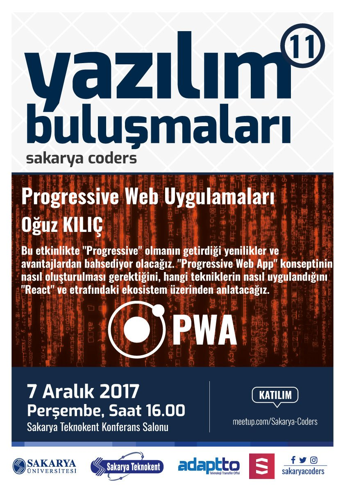

## Progressive Web Uygulamaları - 7 Aralık 2017

Bu etkinlikte "Progressive" olmanın getirdiği yenilikler ve avantajlardan bahsediyor olacağız. "Progressive Web App" konseptinin nasıl oluşturulması gerektiğini, hangi tekniklerin nasıl uygulandığını "React" ve etrafındaki ekosistem üzerinden anlatacağız.

### Konuşmacı Hakkında

Oğuz Kılıç ([@0guzKilic](https://twitter.com/0guzKilic)), 2010 yılından bu yana birçok şirkette "Software Developer", "Frontend Engineer" gibi pozisyonlarda iş tecrübesi edinmiştir.

Şu an "Modern Frontend Mimarileri" ve "Progressive Web Uygulamaları" gibi çeşitli konularda şirketlere danışmanlık vermektedir. Aynı zamanda [Frontend İstanbul](http://frontend.istanbul) topluluğunun kurucularından biri olarak ekosistemin gelişmesinde aktif sorumluluk üstlenmektedir.

Amatör bilim kurgu yazarı olan Oğuz, boş zamanlarında bir bilim kurgu kitabı yazmaktadır ve sıkı bir Star Wars hayranıdır.

### Meetup Sayfası

<a href="https://www.meetup.com/Sakarya-Coders/events/245182413/" target="_blank">meetup.com/sakarya-coders</a>

### Sunum Dosyası

<a href="sakarya-coders-pwa-sunum.pdf" target="_blank">Dosya linki</a>

### Faydalı Linkler
- <a href="https://medium.com/@oguzkilic/modern-front-end-yakla%C5%9F%C4%B1m%C4%B1-88f34057402a" target="_blank">Modern Front-End Yaklaşımı</a>
- <a href="https://medium.com/@oguzkilic/modern-front-end-yakla%C5%9F%C4%B1m%C4%B1-part-2-e37386f0ab05" target="_blank">Modern Front-End Yaklaşımı Part-2</a>
- <a href="https://pwa.rocks" target="_blank">Progressive Web Uygulamaları - pwa.rocks</a>

### Afiş

